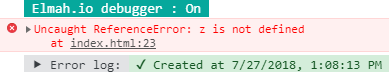

# elmahio-logger
 

### Initialization

Immediately-Invoked Function Expression (IIFE)
```
<script src="elmahio-logger.js?api_key=YOUR-API-KEY&log_id=YOUR-LOG-ID&iife=1" type="text/javascript"></script>
```

or

UMD Constructor with inline parameters
```
<script src="elmahio-logger.js?api_key=YOUR-API-KEY&log_id=YOUR-LOG-ID" type="text/javascript"></script>
<script type="text/javascript">
  var log = new Elmahio();
</script>
```

or

UMD Constructor with options
```
<script src="elmahio-logger.js" type="text/javascript"></script>
<script type="text/javascript">
  var log = new Elmahio({
    apiKey: 'YOUR-API-KEY',
    logId: 'YOUR-LOG-ID',
  });
</script>
```


### Default options
```
new Elmahio({
  apiKey: null,
  logId: null,
  debug: false
});
```


### Debugging
```
debug: true
```



### Manual logging
*Works only with UMD Constructor !*
```
var log = new Elmahio({
  apiKey: 'YOUR-API-KEY',
  logId: 'YOUR-LOG-ID',
});

log.verbose(msg);
log.verbose(msg, error);

log.debug(msg);
log.debug(msg, error);

log.information(msg);
log.information(msg, error);

log.warning(msg);
log.warning(msg, error);

log.error(msg);
log.error(msg, error);

log.fatal(msg);
log.fatal(msg, error);
```
Where __msg__ is a text string and __error__ is a [JavaScript Error Object](https://developer.mozilla.org/en-US/docs/Web/JavaScript/Reference/Global_Objects/Error).

##### Example:
```
log.information('A message here', new Error('A human-readable description of the error'));
```
